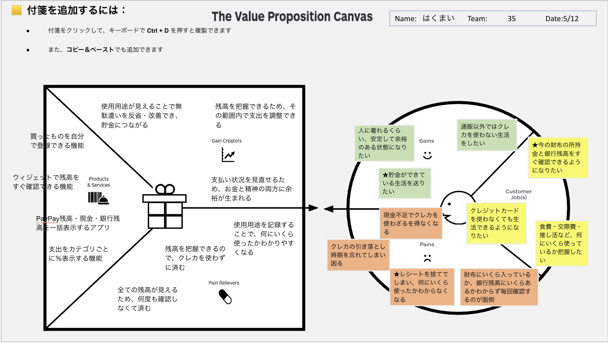

# VPC v1 - hakumai0074

> 「**自分や周りの人を顧客に設定**」したVPC。13週後の自分が欲しいもの・身近な人のために作りたいものを設計する。
> v1 でいい。完璧を目指さない。第6回でアップデート(v2)します。

---

## 1. 解決したい困りごとを 1つ 選ぶ

> [`bug-list.md`](./bug-list.md) の20個から、**「自分が一番これを解決したい!」と思うもの** を1つ選んでください。
> 1つに絞れなければ、複数候補を書いてOK(後で絞り込みます)。

**選んだ困りごと**:

5. 今自分がいくら持っているかわからない

---

## 2. その解決策のアイデアを書く

> 選んだ困りごとに対する「**こうだったらいいのに**」を1つ書く。
> 現実性は気にせず、自由に発想。

**解決のアイデア**:

PayPay残高・現金・銀行残高を一括表示して、今の所持金をすぐ確認できるアプリ

---

## 3. VPC本体

> 上で選んだ「困りごと」と「解決のアイデア」を起点に、6要素を埋めていきます。

### 🟦 Customer Profile(顧客=自分自身)

#### Jobs(やりたいこと・動詞で書く)

- ★今の財布の所持金と銀行残高をすぐ確認できるようになりたい
- クレジットカードを使わなくても生活できるようになりたい
- 食費・交際費・推し活など、何にいくら使っているか把握したい

#### Pains(困っていること)

- 現金不足でクレカを使わざるを得なくなる
- クレカの引き落とし時期を忘れてしまい困る
- ★レシートを捨ててしまい、何にいくら使ったかわからなくなる
- 財布にいくら入っているか、銀行残高にいくらあるかわからず毎回確認するのが面倒

#### Gains(得たい未来・状態)

- 人に奢れるくらい、安定して余裕のある状態になりたい
- ★貯金ができている生活を送りたい
- 通販以外ではクレカを使わない生活をしたい

---

### 🟧 Value Map(あなたが作るもの)

#### Products & Services

- 買ったものを自分で登録できる機能
- ウィジェットで残高をすぐ確認できる機能
- PayPay残高・現金・銀行残高を一括表示するアプリ
- 支出をカテゴリごとに%表示する機能

#### Pain Relievers

- 全ての残高が見えるため、何度も確認しなくて済む
- 残高を把握できるので、クレカを使わずに済む
- 使用用途を記録することで、何にいくら使ったかわかりやすくなる

#### Gain Creators

- 使用用途が見えることで無駄遣いを反省・改善でき、貯金につながる
- 残高を把握できるため、その範囲内で支出を調整できる
- 支払い状況を見直せるため、お金と精神の両方に余裕が生まれる

---

## 4. Fit確認(整合チェック)

| Pains/Gains | ↔ | Pain Relievers / Gain Creators | チェック |
|---|---|---|---|
| 現金不足でクレカを使わざるを得なくなる | ↔ | 残高を把握できるので、クレカを使わずに済む | ✓ |
| レシートを捨ててしまい、何にいくら使ったかわからなくなる | ↔ | 使用用途を記録することで、何にいくら使ったかわかりやすくなる | ✓ |
| 財布にいくら入っているか、銀行残高にいくらあるかわからず毎回確認するのが面倒 | ↔ | 全ての残高が見えるため、何度も確認しなくて済む | ✓ |
| 貯金ができている生活を送りたい | ↔ | 使用用途が見えることで無駄遣いを反省・改善でき、貯金につながる | ✓ |
| 人に奢れるくらい、安定して余裕のある状態になりたい | ↔ | 支払い状況を見直せるため、お金と精神の両方に余裕が生まれる | ✓ |

> 整合しないものは「自分が作りたいだけ」のプロダクトになりがち。
> 迷ったら AI大学講師に壁打ち。
